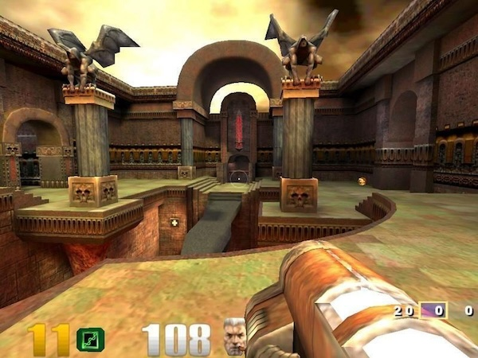
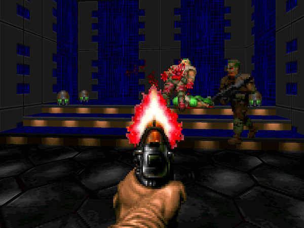
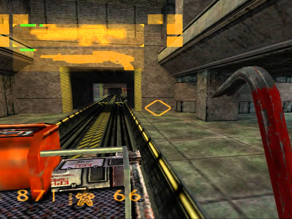

Hey everyone, I have an quick but exciting announcement to make today.  

## Announcement
Earlier this year, I mentioned I was in the planning stage of a new game that would start development in 2024.

Well, it's now time to start production; today is the first day of development on the game (codenamed Project Vore).

The game design is inspired by classics [Quake 3 Arena](https://www.youtube.com/watch?v=YK8fgDXDGKg), [Doom](https://www.youtube.com/watch?v=Q4GiCg_m8wA) and [Half-Life](https://www.youtube.com/watch?v=JoV9o6b91Sc).

## Built with Open Source
An important aspect this game to me (and I'm sure to others interested) is developing it with open-source tech.

As a Linux user, you can be assured that native Linux support is a priority. Of course, it will also be available on
macOS and Windows as well (and maybe consoles one day).

Stay tuned for frequent updates coming soon.
