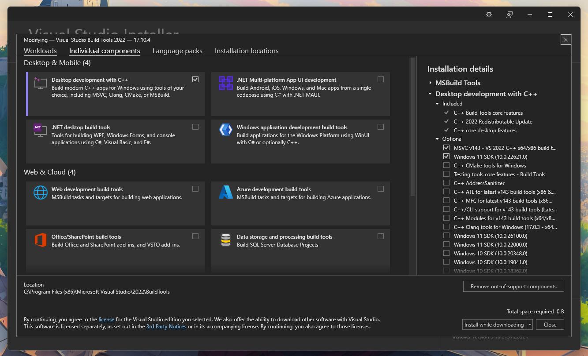
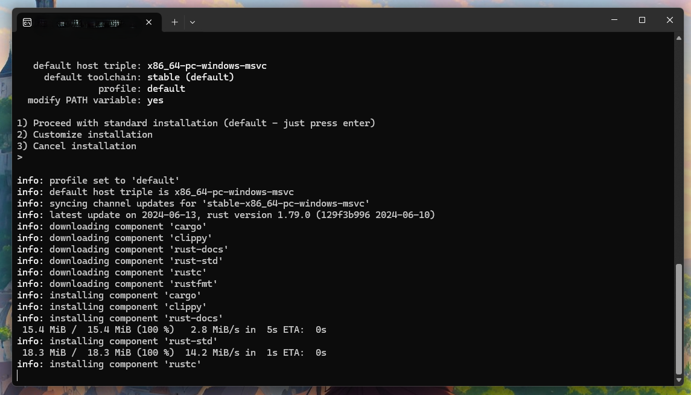
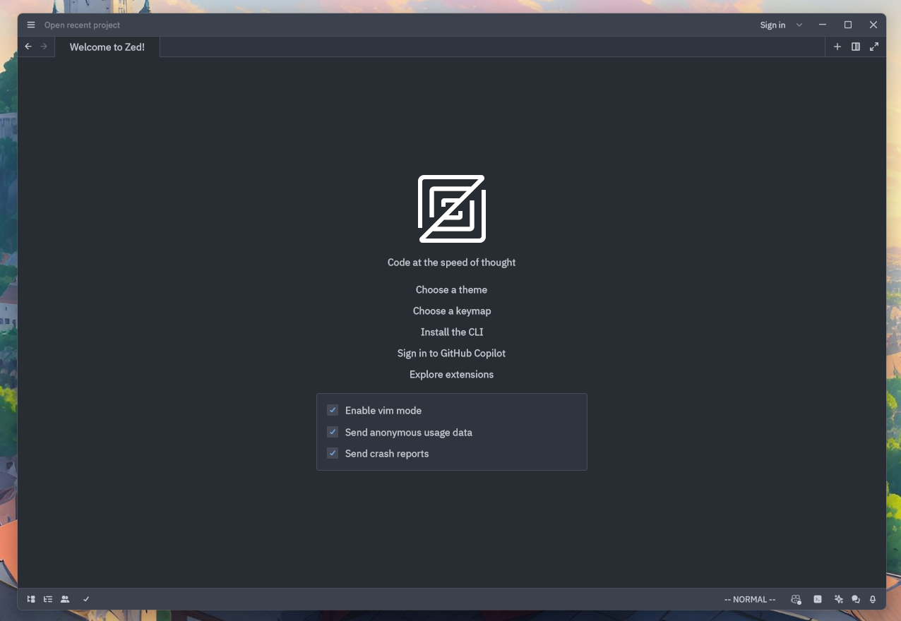

## Introduction
Have you heard about [Zed](https://zed.dev)? It's that new code editor written in Rust with a focus on performance and collaboration.
It was made by the folks that brought us Atom and Electron.

I've been waiting to try it out, and now we have official binaries for Linux.
Unfortunately, Windows still requires a build from source.

However, it's incredibly easy to do, and I need an excuse to to test the build out since my new project is still on my Mac.
Thus, I give you this somewhat redundant post to show you how I did it.

## Install Visual Studio Build Tools
First, we need a C/C++ compiler and linker for Windows. I installed the [Visual Studio Build Tools](https://visualstudio.microsoft.com/downloads/#build-tools-for-visual-studio-2022).

Make sure to check the "Desktop development with C++" workload along with the "MSVC v14x C++ x64/x86 tools" and Windows 11 or 10 SDK depending on your version of Windows. I unchecked the other optional tools.

## Install Rust
Once that is done, we're ready to install Rust. Simply download rustup [here](https://www.rust-lang.org/tools/install) and execute it to go through the quick process.

## Clone Zed
Now that we have the prerequisites out of the way, clone the Zed source code.
`git clone https://github.com/zed-industries/zed.git`

## Build
Navigate to the new `zed` folder and run
`cargo build --release`

If the build was successfull, you should now have a shiny zed.exe located in
`zed\target\release`.

That's it. Now, back to coding.
